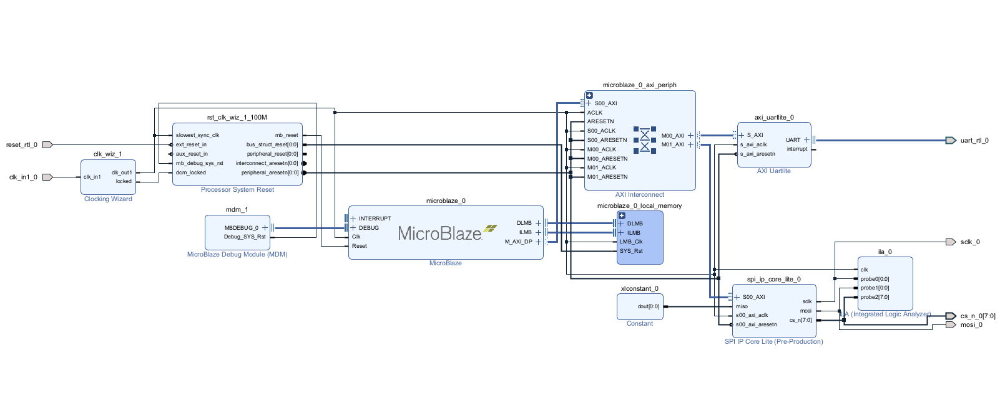
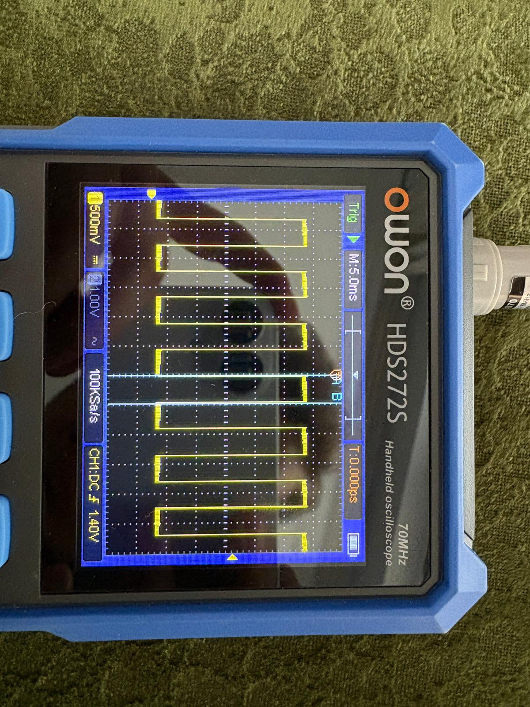

# SPI Lite IP Core (AXI4-Lite)

A lightweight AXI4-Lite SPI **master** IP core for Xilinx FPGAs, written in Verilog and packaged with the Vivado IP Packager. It fills a gap in the Vivado IP catalog: while UART and Ethernet ship with a slim *Lite* variant, SPI is only available as the full-featured **AXI Quad SPI** core.

> Graduation thesis project — Department of Electrical & Electronics Engineering, Gazi University, 2026.

---

## Motivation

For low-throughput jobs such as driving a DAC or writing a handful of configuration registers, the FIFOs, interrupt logic, and Dual/Quad-mode support of the AXI Quad SPI core turn into wasted fabric. This project implements a minimal SPI master with a clean AXI4-Lite interface and verifies it end to end on a Digilent Nexys A7-100T driving a Pmod DA4 (Analog Devices AD5628) DAC.

## Features

- AXI4-Lite slave interface with a five-register memory map
- SPI **Mode 1** (CPOL = 0, CPHA = 1): data sampled on the falling edge of SCLK, as required by the AD5628
- MSB-first, parameterizable data width (`DATA_WIDTH = 32` by default)
- Hardware (FSM-driven) chip-select control across **8 CS lines**
- Programmable clock prescaler (default 1 MHz from a 100 MHz system clock)
- Polling-based status via a `busy` flag — no interrupts, which keeps the core lean
- Packaged as a reusable Vivado IP (`component.xml` included)

## Architecture

The transfer logic is a four-state FSM: `IDLE → PREPARE → TRANSFER → FINISH`.

- **PREPARE** drives the selected CS line low and waits at least 2 clock cycles (meets AD5628 t4 = 13 ns).
- **TRANSFER** shifts `DATA_WIDTH` bits MSB-first at the prescaled SCLK rate.
- **FINISH** raises CS and holds it high for at least 2 clock cycles (meets AD5628 t8 = 15 ns).

Which of the 8 CS lines goes active is chosen by a 3-bit field in the Control register.

### Register map

| Offset | Register  | Description                                    |
|:------:|-----------|------------------------------------------------|
| `0x00` | TX Data   | Word to transmit                               |
| `0x04` | RX Data   | Word received                                  |
| `0x08` | Control   | SPI enable, CS select (3-bit), transfer start  |
| `0x0C` | Status    | Busy flag, Done-sticky flag                    |
| `0x10` | Prescaler | SCLK divider (default 50 → 1 MHz)              |

## Repository structure

| Folder         | Contents                                               |
|----------------|--------------------------------------------------------|
| `rtl/`         | `spi_master_lite.v` (core), `spi_ip_core_lite_v1_0_S00_AXI.v` (AXI4-Lite wrapper), `spi_ip_core_lite_v1_0.v` (IP top) |
| `sim/`         | `tb_spi_master_lite.v` (testbench + SPI slave model)   |
| `constraints/` | `kisit.xdc` (Nexys A7 pin constraints)                 |
| `firmware/`    | `main.c` (MicroBlaze firmware)                         |
| `software/`    | `spi_ip_core.py` (Python host-side control script)     |
| `docs/`        | Block diagram, ILA and oscilloscope captures, resource and power reports |
| `ip_repo/`     | Packaged IP (`spi_ip_core_lite_1_0/`, incl. `component.xml`) |

## Hardware setup

Target board: **Digilent Nexys A7-100T**. DAC: **Pmod DA4** (AD5628). The pin assignments below are taken directly from the constraint file (`constraints/kisit.xdc`).

| Signal    | FPGA pin |
|-----------|:--------:|
| clk       | E3       |
| reset     | C12      |
| MOSI      | F16      |
| SCLK      | H14      |
| ~CS[0]    | D14      |
| ~CS[1..7] | F6, J2, G6, E7, J3, K1, E6 |

The core exposes 8 chip-select lines; this application drives a single DAC, so only `~CS[0]` is wired to the module. MISO is intentionally left out of the constraints: the DA4 has no data-out line, so the RX path is verified in simulation only.

UART bridge (on-board FT2232HQ): TXD = D4, RXD = C4, 9600 baud.

## Embedded system



A MicroBlaze soft processor drives the core over AXI4-Lite. The block design combines MicroBlaze, AXI UartLite, the custom SPI Lite IP, a Clocking Wizard, Processor System Reset, Local Memory (BRAM), the MicroBlaze Debug Module, and an AXI Interconnect.

### Driving the AD5628 DAC

At start-up the firmware enables the internal 1.25 V reference (command `0x08000001`). With the ×2 gain this gives a 0–2.5 V output range:

```
Vout = (DAC_code / 4096) × 2.5 V
```

LDAC is tied low, so every write updates the output immediately. A 32-bit command word is framed as:

```
[4-bit don't care][4-bit command 0011 = write & update][4-bit address 0000 = DAC A][12-bit data][8-bit don't care]
```

### Host control (Python)

A Python script talks to the firmware over the USB-UART bridge and sends single-byte commands:

| Byte   | Action        |
|:------:|---------------|
| `0x00` | Reset (stop waveform) |
| `0x01` | Square wave   |
| `0x02` | Sine wave     |
| `0x03` | Sawtooth      |
| `0x04` | Triangle      |

Waveforms use 256 samples per period.

## Verification



- **Simulation** — a Verilog SPI slave model exercises both the TX and RX paths.
- **On-hardware** — Vivado ILA captures SCLK, MOSI, and CS on the live design.
- **Real-world** — the DAC output is confirmed with a multimeter (square wave, 0 V / 2.5 V) and an oscilloscope (sine, sawtooth, triangle).

## Documentation

This project was carried out as a graduation thesis. Selected figures — the block design, ILA captures, and oscilloscope results — are collected in [`docs/`](docs/).
Thesis title: *Design of an SPI Lite IP Core on FPGA and Its Verification with Pmod DA4.*

## License

Released under the MIT License — see [LICENSE](LICENSE).

## Author

**Semih Cengiz** — Electrical & Electronics Engineering, Gazi University
GitHub: [@semih-cengiz](https://github.com/semih-cengiz)
